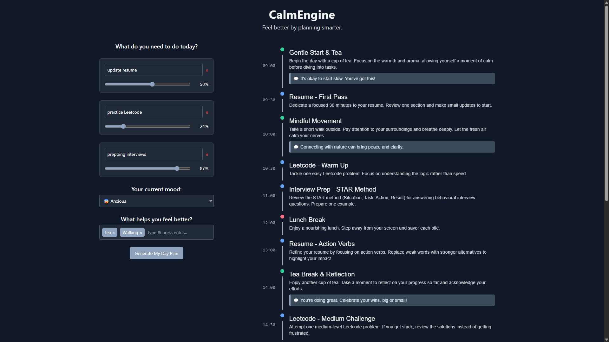

# CalmEngine

**CalmEngine** is a personalized productivity tool designed to help users plan a peaceful, emotionally supportive day. It uses AI to generate a one-day schedule based on your current mood, favorite relaxing activities, and prioritized tasks.


---

## Demo
👉 [Watch the demo on YouTube](https://youtu.be/O3osmzLPRaA)

---

## Features

- Add custom tasks with individual priority (via percentage)
- Select your current mood from an emoji-enhanced list
- Add multiple relaxing activities as tags (e.g. tea, knitting, walking)
- Uses **gemini-2.0-flash** model to generate a smart, full-day schedule
- Visual timeline with color-coded tasks
- Real-time highlighting of the current task
- Responsive dark UI with Morandi-inspired styling

---

## Getting Started

### 1. Clone the repository

```bash
git clone https://github.com/laiyousin/calm-engine.git
cd calmengine
```

### 2. Install dependencies
```bash
yarn install
```

### Set up your Gemini API key
Create a ```.env``` file in the project root and add:
```bash
VITE_GEMINI_API_KEY=your_api_key_here
```
Get your API key from [Google AI for Developers](https://ai.google.dev/gemini-api/docs/api-key)

---
## Run the App
```bash
yarn dev
```
Open your browser at [http://localhost:5173](http://localhost:5173)

---

## How to Use?
1. Add Tasks
    - Type your tasks and press Enter to add new ones
    - Adjust their priority with the slider (percentage of day)
2. Select Your Mood
    - Choose from common feelings like 😰 anxious, 😴 tired, 🤩 excited, etc.
3. Add Relaxing Activities
    - Add what helps you feel better as tags.
4. Generate Schedule
    - Click the Generate My Day Plan button
    - AI will create a timeline from 09:00 to 21:00
5. Follow Your Plan
    - The schedule is shown as a vertical timeline
    - The current task is automatically highlighted in real-time

---

## Author

Made solo during a hackathon by **Cindy Lai** 💛
_“Feel better by planning smarter.”_

- 🌐 [Personal Website](https://laiyousin.github.io/)
- 💼 [LinkedIn](https://www.linkedin.com/in/yu-hsin-lai/)

---

## License

This project is not open source.
All rights reserved © 2024 by Cindy Lai.

Unauthorized copying or redistribution is prohibited.